# RepoTemplate.jl

[](https://github.com/JuliaOceanWaves/RepoTemplate.jl/actions/workflows/Test.yml)
[](https://codecov.io/gh/JuliaOceanWaves/RepoTemplate.jl)
[](https://platform.juliahub.com/ui/Packages/General/RepoTemplate?t=2)

## Template Instructions

You can use this template through two different ways.

Near the top of this page you can click the button "Use this template":

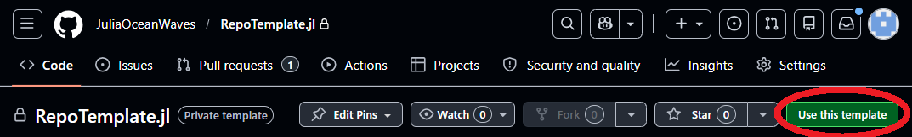

Which will set automatically select the template on the following screen:

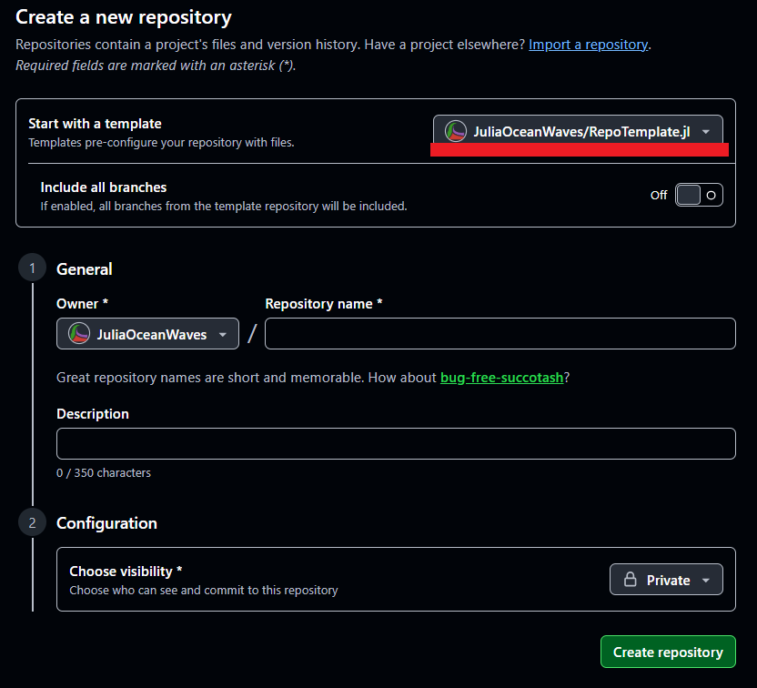

Alternatively, when you create a new repository:

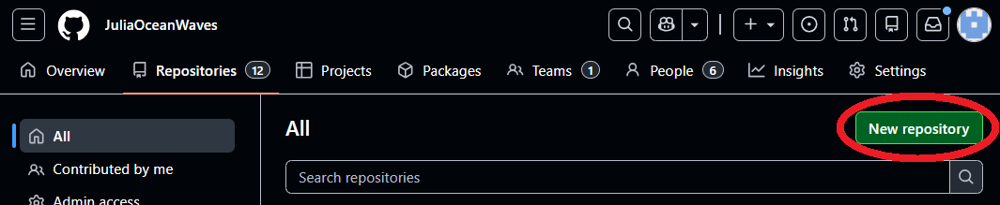

You can select this template from the dropdown menu:

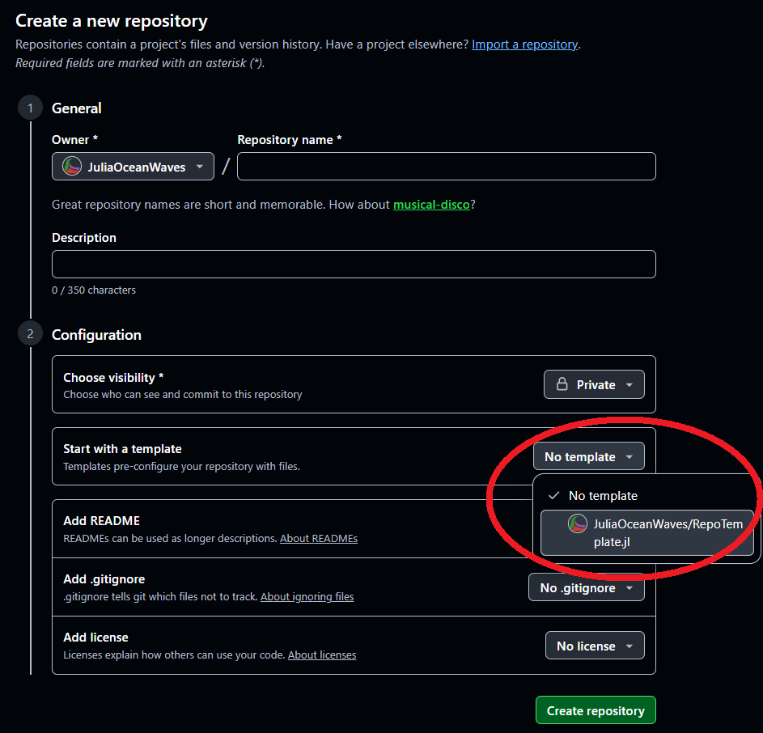


## Setup

### Badges

The boxes below the title that show different statuses are badges available from 
Github Actions, CodeCov, and JuliaHub. (The JuliaHub badges may sometimes be broken, check
out the website and check first if they are working there.)

If you go to Github Actions:

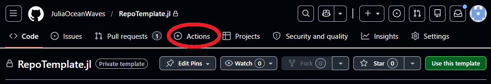

Select an action, then click on the meatball menu on the right:

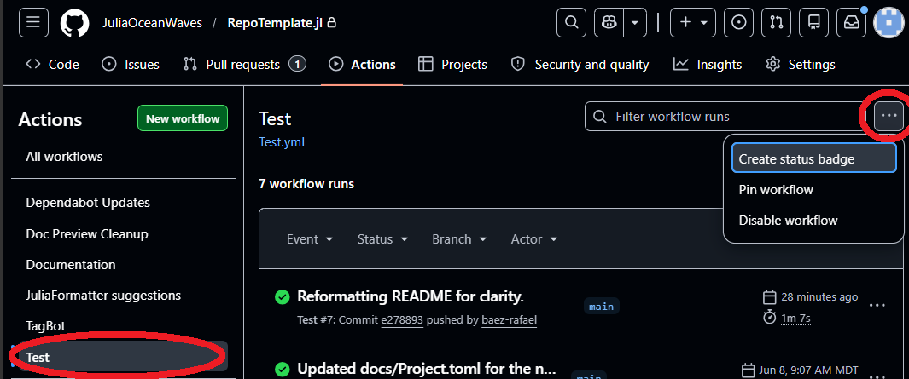

You will see the markdown text and a button to automatically copy the text:

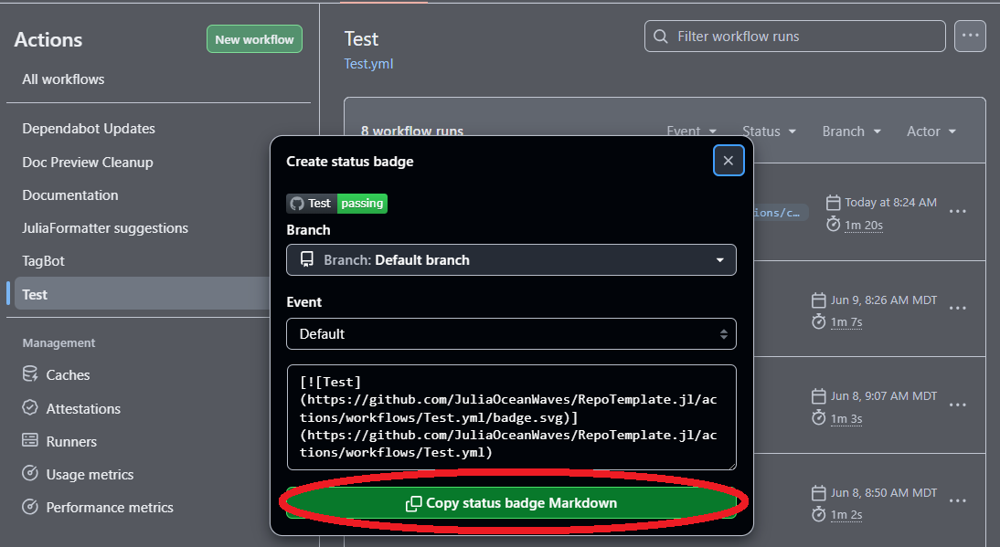

Which you can use to populate the `README.md`. You can see an example of the Test workflow
badge at the top of this `README.md`. 

For the CodeCov badge, you must the repository must be public and registered on 
[CodeCove](https://app.codecov.io). You need to configure the repository following the
instructions on the website.

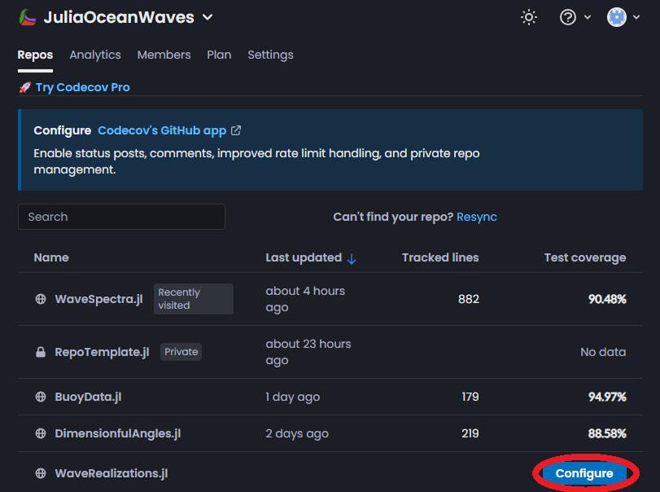

Afterwards, you go to the tab for `Configuration`.

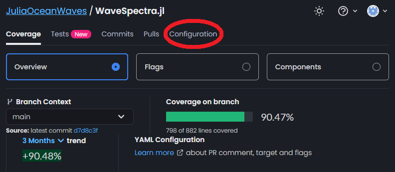

Click on `Badges & Graphs`

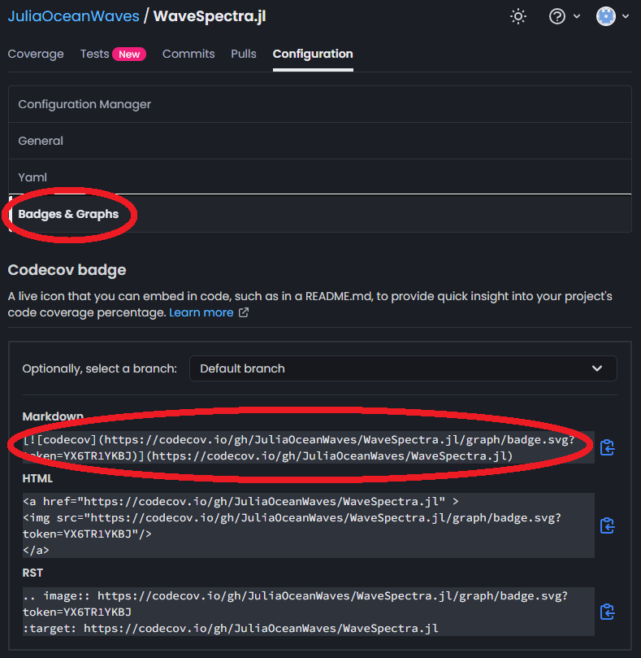

And you can copy and paste the markdown code.

Once your package is registered on JuliaHub, there are a few badges available. Search for it
in the [JuliaHub Package Search](https://platform.juliahub.com/ui/Packages/),
and click on the badge you want. It will automatically copy the markdown code for the badge
to your clipboard.

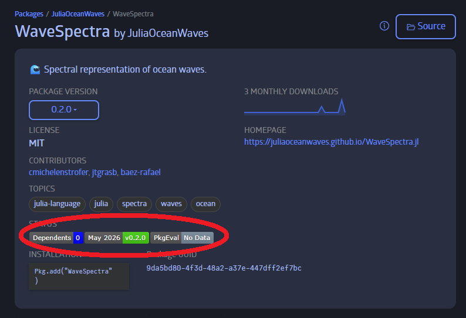

### Keys & Secrets

Documenter has a nice [section](https://documenter.juliadocs.org/stable/man/hosting/#GitHub-Actions)
explaining the following so feel free to check it out if you're interested. In order for
Documenter and TagBot to work properly they need the following to be set up.

```julia
pkg> add DocumenterTools
```

**_NOTE:_** It is recommended to add these types of packages in the dev environment for julia
rather than in each repository. This environment is in the following location by default: 
`C:\Users\$USER\.julia\dev`


```julia
julia> using DocumenterTools
julia> DocumenterTools.genkeys(user="MyUser", repo="MyPackage.jl")
```

Which should generate a message similar to the one below.

```
[ Info: add the public key below to https://github.com/USER/REPO/settings/keys
      with read/write access:

[SSH PUBLIC KEY HERE]

[ Info: add a secure environment variable named 'DOCUMENTER_KEY' to
  https://travis-ci.com/USER/REPO/settings with value:

[LONG BASE64 ENCODED PRIVATE KEY]
```

For the SSH key go into Settings:

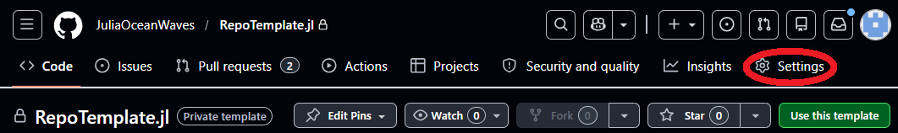

Under Security and Quality is Deploy Keys:

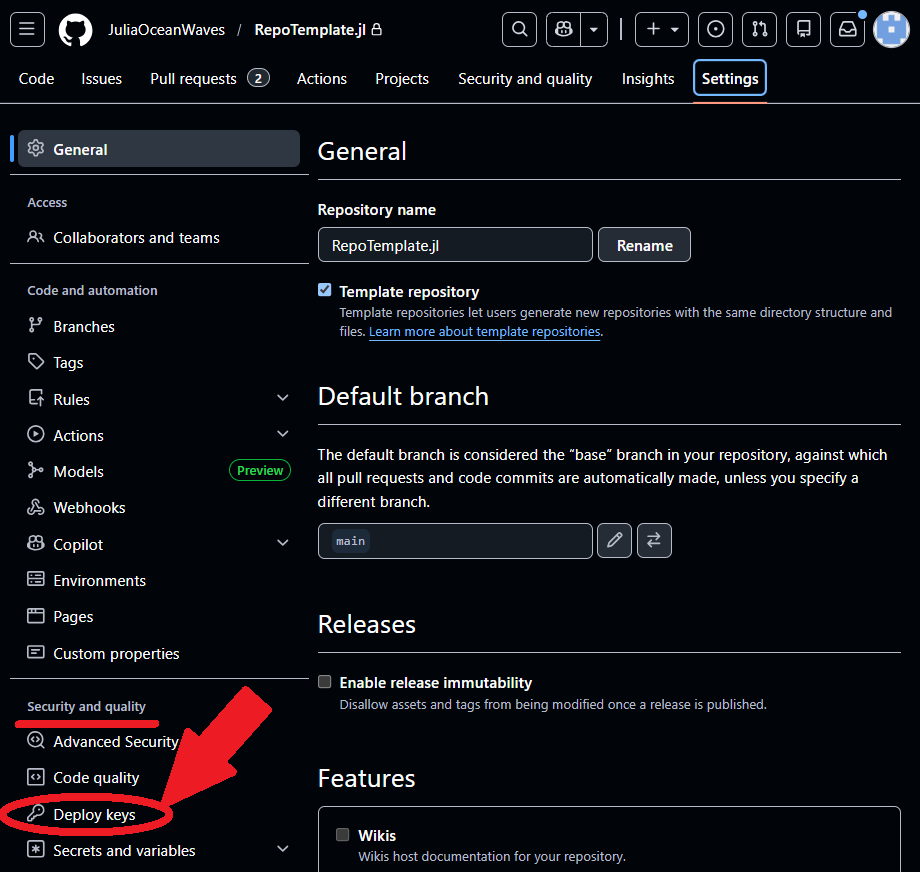

Add a deploy key, the name here is solely for organization:

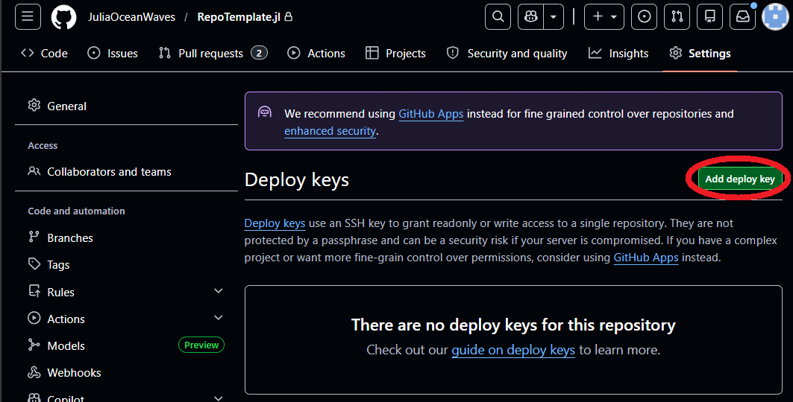

For the private key key from Settings go to Secrets and variables, under it is Actions:

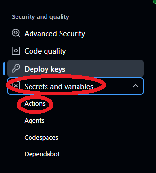

Add a repository secret with the name `DOCUMENTER_KEY`, the name DOES matter here.

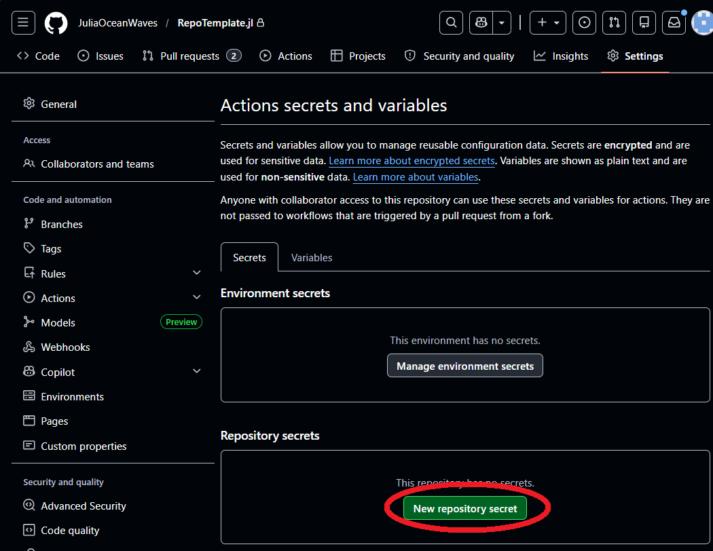

### Documenter

It matters whether you do `pkg> add` vs `pkg> develop`. That is why we mention the 
RepoTemplate.jl references in the docs/Project.toml as well. In the case that Documenter 
doesn't generate the documentation, you can try:

```julia
julia>]
pkg>activate docs
pkg>develop ../RepoTemplate.jl
```

So that Documenter knows where the package is, rather than looking for a remote repository.

Additionally, you need to set up the Github Pages to be hosted. In settings go to Pages:

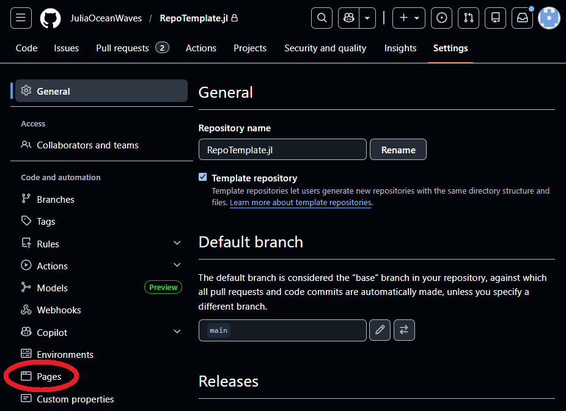

And configure it to deploy from the `gh-pages` branch:

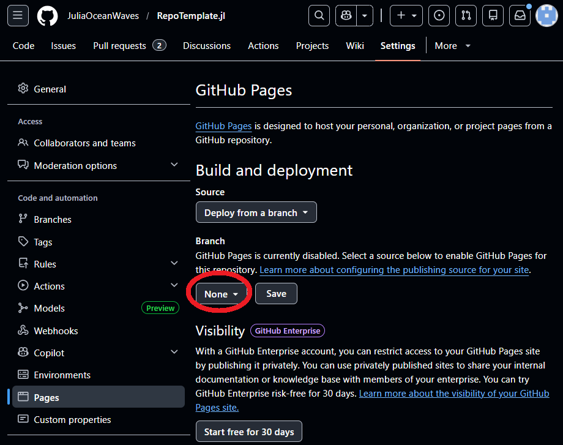

Make sure to also update the `About` description with a very brief one sentence description as
well as the updating the documentation link.

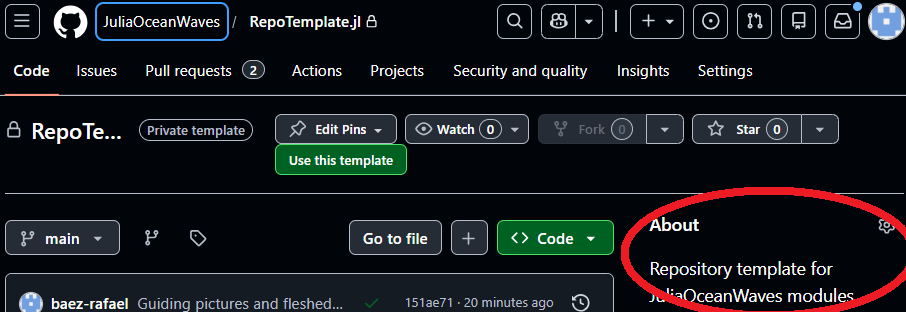

### Placeholder Values

The UUID in `./Project.toml` NEEDS to be updated. In the julia REPL it is as simple as:

```julia
julia> using UUIDS
julia> UUIDS.uuid4()
UUID("XXXXXXXX-XXXX-XXXX-XXXX-XXXXXXXXXXXX")
```

The following are a list of references to RepoTemplate.jl that should be updated with the
new repository name or removed as appropriate.

`.github/workflows/Test.yml`
  - `Line 43/ slug: JuliaOceanWaves/RepoTemplate.jl`

`docs/src/index.md`
  - `Line 17/ Modules = [RepoTemplate]`

`docs/make.jl`
  - `Line 4/ DocMeta.setdocmeta!(RepoTemplate, :DocTestSetup, :(using RepoTemplate); recursive = true)`
  - `Line 9/ sitename = "RepoTemplate.jl",`
  - `Line 14/ modules = [RepoTemplate],`
  - `Line 22/ repo = "github.com/JuliaOceanWaves/RepoTemplate.jl.git",`

`docs/Project.toml`
  - `Line 3/ RepoTemplate = "853e458c-f57f-4a7c-9434-3617a48582a4"` 

`test/Project.toml`
  - `Line 6/ RepoTemplate = "853e458c-f57f-4a7c-9434-3617a48582a4"`

`test/runtests.jl`
  - `Line 3/ @time @testset verbose = true "RepoTemplate.jl" begin`

`test/test_doctest.jl`
  - `Line 3/ using RepoTemplate`
  - `Line 4/ doctest(RepoTemplate)`

`test/test_main.jl`
  - `Line 2/ using RepoTemplate`

`./Project.toml`
  - `Line 1/ name = "RepoTemplate"`
  - `Line 2/ uuid = "853e458c-f57f-4a7c-9434-3617a48582a4"`

`./README_template.md`
  - `Line 3/ [](https://github.com/JuliaOceanWaves/RepoTemplate.jl/actions/workflows/Test.yml)`
  - `Line 4/ [](https://codecov.io/gh/JuliaOceanWaves/RepoTemplate.jl)`
  - `Line 5/ [](https://platform.juliahub.com/ui/Packages/General/RepoTemplate?t=2)`


IF YOU CHANGED THE NAME OF THE DOCUMENTER_KEY!

`.github/workflows/Documentation.yml`
  - `Line 37/ DOCUMENTER_KEY: ${{ secrets.DOCUMENTER_KEY }}`

`.github/workflows/Tagbot.yml`
  - `Line 24/ ssh: ${{ secrets.DOCUMENTER_KEY }}`
